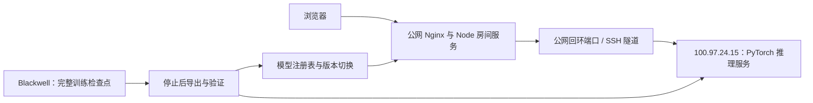

# 在线模型与推理部署

网页和房间服务在公网服务器运行，模型决策由 `zich@100.97.24.15` 计算，通过反向 SSH 隧道返回动作。租用 Blackwell 服务器负责训练。网页推理不占用该训练 GPU。



日常查看、发布和回滚条件见 [运维说明](tavern-operations.md)。浏览器访问 `https://8.153.150.101/tavern/`，模型端口仅监听回环地址。

## 模型注册与网页选择

以下是 2026-09-15 文档核对时 `deploy/inference-models.json` 的快照。后续上线以注册表及 `status` 输出为准。

| 选项 | 模型标识 | 已发布局数 | 公网回环端口 | 计算端口 |
| --- | --- | ---: | ---: | ---: |
| 64 层 | `deep64-1480` | 2568 | 18891 | 18890 |
| 256 层 | `deep256-1164` | 2140 | 18893 | 18892 |
| 1024 层 | `deep1024-612` | 1284 | 18895 | 18894 |
| 64 层加搜索 | `deep64-search-2568` | 2568 | 18897 | 18896 |
| 256 层加搜索 | `deep256-search-2140` | 2140 | 18901 | 18900 |
| 1024 层加搜索 | `deep1024-search-1284` | 1284 | 18903 | 18902 |

普通模型的 ID 保留了早期名称，末尾数字不是当前局数。判断版本应读 `episodes` 和 `checkpointSha256`。搜索选项使用独立冻结服务，当前 `publish` 更新三个普通模型并保留搜索版本。

房主选择同桌人机使用的模型，加入者沿用房间设置。`POST /tavern-api/create` 接收注册表中的 `modelId`，省略时使用默认项；服务端拒绝未知模型，不接受客户端指定的服务地址或权重路径。

`GET /tavern-api/models` 返回标签、局数和可用状态，不公开内部地址。房间保存模型标识和检查点哈希，刷新和重连保留选择。服务端健康检查核对端点、观察契约和权重身份，不只检查 HTTP 是否能连通。

## 一次推理的输入输出

服务端提取 `scouting-v4` 公开观察、合法动作、当前座位记忆和上一动作。Python 计算动作，并返回更新后的 128 维 GRU 记忆。各房间、各座位独立保存状态，记忆跨回合保留，不能混用其他玩家的状态。

输入含自己的牌、经济和公开历史战况，不含对手私有手牌或当前招募阵容。普通推理只计算策略分支；搜索同时使用策略与价值分支。网络与观察定义见 [模型结构](rl-network.md)。

响应回来后，房间重新检查阶段、回合和座位状态，丢弃过期响应。共享牌池变化导致动作无法执行时重新观察。模型不可用或响应无效时，服务按已有回退逻辑处理并在界面提示；健康接口记录错误和回退。搜索还会因无法重建公开局面、预算不足等原因退回原策略，见 [搜索说明](rl-recruit-search.md)。

## 带宽和计算

请求和响应使用 gzip。公网后端通过 `TAVERN_INFERENCE_MAX_KBPS` 管理所有模型共用的发送预算，当前部署值为 512 kbps，面向原 3 Mbps 带宽约束。应用按压缩载荷和每次请求预留开销安排发送间隔，这不是网卡硬限速，也不包含全部 SSH / TCP 开销。

模型计算在远端推理机完成，隧道只传观察和动作。增加房间或启用搜索会增加排队和计算时延；搜索的 1000 毫秒软预算不是端到端请求时延保证。后台流量统计见 `/tavern-api/health` 的 `ai.traffic`，服务重启后重新计数。

权重和 Python 代码保存在计算机 `~/.local/share/tavern-models/` 的版本目录中，由用户级 systemd 服务与隧道单元管理。计算机需保持联网。SSH 密钥、凭据和运行中的私有数据不纳入 Git。

## 导出和验证

完整检查点 `latest.pt` 用于续训，导出的 `model.pt` 用于推理。导出检查动作词表、实体布局、权重有限性及观察契约，模型服务核对检查点哈希。改变规则或字段后，不能只替换权重来绕过兼容检查。

仓库手工导出的命令如下，通常优先使用运维入口完成全部验证：

```bash
node --import tsx --input-type=module -e 'import {inferenceProfile} from "./server/neural-profile.ts"; import {writeFileSync} from "node:fs"; writeFileSync("/tmp/tavern-serving-schema.json", inferenceProfile("scouting-v4").schema)'
.venv/bin/python scripts/export-inference.py PATH_TO_TRUSTED_CHECKPOINT /tmp/tavern-serving-schema.json PATH_TO_MODEL_PT
PYTHONPATH=rl/python .venv/bin/python -m tavern_rl.serve PATH_TO_MODEL_PT --port 18790
```

模型导出不会自动切换网页。正式发布要求训练停止、检查当前房间、使用独立版本目录、验证推理，再切换注册表和服务。回滚时需要成套恢复模型、观察契约和服务配置，不能混搭新旧版本。

本轮六个选项的部署验证见 [深层搜索记录](rl-deep-search-deployment-20260915.json)。更早的三模型接入、压测和计算迁移保留在 [2026-09-11 历史说明](neural-serving-20260911.md)，其中旧服务名称和路径仅用于追溯。
