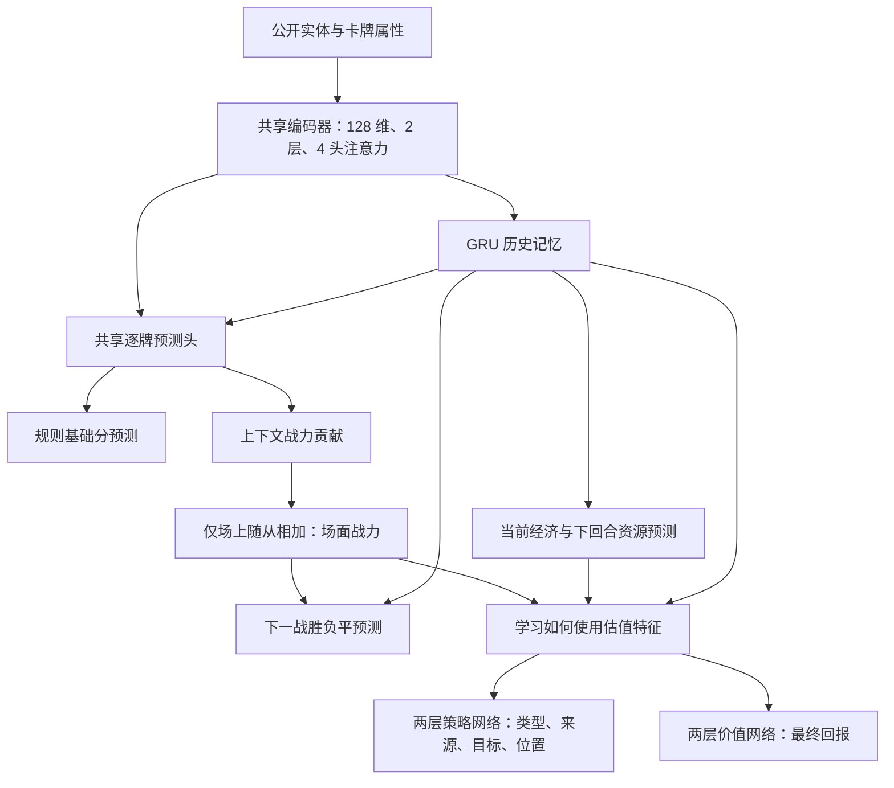

# 逐牌战力与经济网络

2026-09-17，本地新架构 `entity-gru-ledger`，未部署线上。旧的 64／256／1024 层模型保持不变。

## 网络



模型有 1,477,133 个参数，导出文件约 6.85 MB。策略与价值分支各使用两层全连接网络，保留原来的分层合法动作概率。最后一个实体通道保留为随从存在标记，因此空位、法术和未持有的酒馆牌不会混入场面总分；这一标记不依赖跨请求缓存。

同一个逐牌头处理酒馆、手牌和场上的随从。基础分监督来自 `src/minion-evaluation.ts`，与人机界面和原基础评分使用同一套公式。训练目标用独立的 `rl-dist/ledger-evaluation.cjs` 提供，未覆盖旧基础反馈评分器。

战力贡献从基础分预测出发，由上下文修正，用真实战斗结果学习。小身材的配合牌可以获得高贡献，修正没有固定的身材倍数上限。实现对指数转换限幅以维持数值稳定。场面分严格等于场上各牌贡献之和，随后结合全局信息预测胜负平。

这些贡献是模型的一种分摊方式，不是移除该牌的因果边际收益，也没有唯一的真实标签。训练尚少时，数值不可靠。下一战预测头也能使用全局记忆，因此还需独立消融评测确认逐牌分支被有效利用。

## 训练目标

完整对局 PPO 的回报仍来自真实名次。本架构不使用基础势函数奖励，不给升本、买卖或囤牌固定加分。

| 监督项 | 标签来源 | 默认损失权重 |
| --- | --- | ---: |
| 逐牌基础分 | 共用规则评分，使用 log1p 分数 | 0.10 |
| 当前经济 | 现金、持有资产、手牌潜力、下回合收入、刷新、折扣、酒馆机会分，分别归一化 | 0.05 |
| 下一战胜负平 | 实际完成的战斗 | 0.10 |
| 下一回合资源 | 存活玩家真正进入下一回合时的金币、酒馆等级、额外收入 | 0.05 |

经济头中的酒馆机会分仍是人工规则标签，不能当作学会了升本长期收益。未来经济预测来自当前策略实际走出的路线，不是某个候选动作的反事实收益。最终价值头通过真实名次训练，独立于这几个辅助标签。

战斗标签只附在对应回合真实 `end` 决策上，避免把后来买到或打出的随从的作用算给招募开头的旧场面。标签可以读取已经发生的战斗，但模型输入始终是行动前的公开观察，未把对手隐藏场面输入网络。淘汰后不伪造下一回合经济，截断游戏仍不进入完整对局 PPO。

辅助输出作为策略与价值分支的输入时停止梯度，PPO 不直接修改辅助输出头的参数；共享编码器仍同时接收各任务梯度。没有人为将高估值加到某种动作的概率上。

## 使用

已存在匹配的训练模拟器时，只需构建新标签模块：

```bash
npm run build:ledger
bash rl/run.sh train --architecture entity-gru-ledger \
  --output rl/runs/ledger-v1 --hidden 128 --heads 4 --layers 2 \
  --learning-rate 0.0001 --ai-action-limits \
  --games-per-iteration 8 --workers 4 --learner-seats 4 \
  --epochs 1 --sequence-length 16 --burn-in 8 --sequence-batch-size 16 \
  --iterations 10 --device cpu
```

GPU 环境可选择 `--device cuda --rollout-device cuda`。本轮未在 GPU 上验证，不声明 GPU 吞吐或显存收益。`--max-actions 16` 仅用于本次短程链路验证，正式实验默认每回合预算 64，不能直接将不同预算的结果作棋力比较。

新目录或新规则版本应另行构建匹配的模拟器，保存它的 sourceHash 和规则版本。不要覆盖既有实验使用的冻结模拟器，再绕过恢复校验。

```bash
bash rl/run.sh train --resume rl/runs/ledger-v1/latest.pt \
  --output rl/runs/ledger-v1 --iterations 10 \
  --workers 4 --sampling-processes 2 --persistent-samplers --device cpu
```

检查点保存目标实现、网络和损失实现的指纹。改动这些实现后会拒绝在同一实验续训。此架构与旧辅助估值模式、基础反馈模式互斥，不受旧辅助模式环境变量自动开启的影响。旧深层模型不能直接作为新架构的 `--resume` 或 `--warm-start`；没有静默丢弃权重或伪装成无损迁移。相容的旧检查点仍可按现有 `--anchors` 机制作为冻结对手。

## 推理和界面

导出器已支持新架构。推理请求增加可选 `judgment: true`，返回逐牌基础分预测、战力参考、场上贡献、经济预测、战斗概率和整体回报。普通决策可以不返回这些明细。服务器将实体槽位绑定到当前玩家 UID，并检查贡献总和、概率、有限数值和卡牌完整性。

“AI 判断”界面保留规则分，同时在接入此架构时显示模型场面战力及逐牌模型贡献。临时顾问使用零历史记忆的限制仍然存在；正常机器人对局使用每席位自己的连续记忆。

## 搜索价值修正

导出器现在记录价值含义。旧基础反馈模型必须从完整训练检查点重新导出，携带 `basicFeedback` 参数和评分器指纹。搜索对根节点和叶节点各还原一次 `V = V_shaped + Φ(s)`，使用匹配的冻结评分器，参数或实现不匹配则拒绝初始化。新架构使用原生回报，无需势函数修正。

此前已发布且缺少奖励元数据的旧导出文件不能自动推断其训练方式，保持旧兼容路径；要修正其搜索必须重新导出并部署匹配评分器。本轮未更新线上文件。招募结束叶节点仍涉及价值网络对训练分布之外状态的泛化，修正偏移不等于已经证明搜索有效。

## 本地验证

最终版本完成 4 局、2 次迭代，共 3,038 次环境动作和 11 次优化器更新。第二次从检查点恢复，使用两路常驻采样进程。没有截断，不是棋力评测。

35 项相关 Python 测试执行成功，其中 1 项因无 CUDA 跳过；另有 10 项搜索测试、80 项 TypeScript 服务端及评分测试通过。新测试覆盖空位与法术排除、贡献加总、共享规则标签、辅助梯度、PPO 梯度隔离、回合/席位标签归属、恢复指纹以及搜索根叶偏移还原。构建通过。真实新权重的推理服务也通过浏览器验证：购买、打出、模型贡献加总及 390px 布局均正常；同一导出权重完成了 4 次招募搜索模拟并返回合法动作。

CPU 单线程、同一个开局观察、预热后 10 次前向的中位耗时如下，只含策略推理：

| 模型 | 参数量 | batch=1 | batch=8 |
| --- | ---: | ---: | ---: |
| 新逐牌模型 | 1.48M | 2.60 ms | 13.14 ms |
| 旧 64 层 | 3.42M | 2.22 ms | 10.25 ms |
| 旧 256 层 | 9.86M | 3.92 ms | 13.11 ms |
| 旧 1024 层 | 35.62M | 11.75 ms | 30.92 ms |

新模型明显小于旧模型，但额外的逐牌预测使它在这个测试中略慢于旧 64 层，不能声称全面提速。下一步应保持相同环境步数和训练时间，加入固定、有合理运营节奏的对手，比较平均名次、前四率、升本时机及无收益买卖次数，再决定是否上线。
