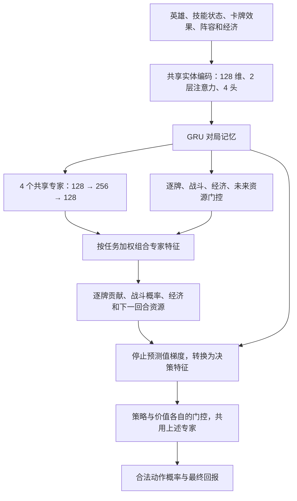

# 酒馆任务门控 MoE

本地架构名为 `entity-gru-moe`。它在逐牌模型上增加共享专家和六个独立门控，采用稠密加权混合。每次计算全部专家，没有 Top-k 丢弃或批次容量限制，也不声称因此节省推理计算。

## 结构



专家只编号，不指定“专家 0 一定负责经济”。有明确含义的是监督任务及其输出头，专家的分工由训练决定。门控的输入是 GRU 状态，包含自己的英雄身份、公开技能状态、当前资源和全局实体注意力编码。改变英雄会改变路由，但这不证明随机初始化的网络理解了英雄打法。

对于任务 t，`w_t = softmax(router_t(LayerNorm(state)))`，`feature_t = state + Σ w_t[i] expert_i(LayerNorm(state))`。保留共享状态的残差，避免混合抵消信息。六个任务分别是 `card/combat/economy/future/policy/value`，最后两个门控使用加入估值特征后的状态。解释接口返回的也是实际用于决策的路由。

单张卡编码仍参与来源和目标选择。场面贡献只汇总场上随从，空位、法术、酒馆牌不进入场面总分。逐牌贡献是模型分摊，不是移除该随从的因果价值。

## 训练

保留 `entity-gru-ledger` 的监督证据：

| 任务 | 数据来源 |
| --- | --- |
| 逐牌基础分 | 共用规则评分器，攻血及部分关键词 |
| 战斗 | 本席位真正结束该次招募后发生的胜负平 |
| 当前经济 | 共用评分器拆出的七项经济指标 |
| 下一回合资源 | 存活后真正进入下一回合的金币、等级、额外收入 |
| 策略和价值 | 完整对局真实名次回报，保留配置中的吃鸡奖励 |

卡牌结构化技能效果已进入共享编码，但本版本没有完成所有技能的规则计价，也没有新增跨回合搜索。未来资源头只预测当前策略的实际后续结果，不能当作某个升本动作的反事实收益。

在原 PPO 和监督损失之外加入批次路由均衡项：对每个任务先求有效样本的平均专家使用率 u，再计算 `E * sum(u²) - 1`，最后对任务取平均。默认系数 0.01。它鼓励一批样本总体使用多个专家，不要求每次决策均匀使用，也不证明专家已形成有用分工。序列填充不参与此损失。系数可在新实验中设置为 0，做消融比较。

日志 `moe` 记录每项任务的平均专家权重、路由熵和均衡损失。这些是更新批次的平均统计，不是专家的棋力评分。PPO 对辅助输出数值停止梯度，仍可更新共享编码和共享专家；辅助输出头继续由对应监督任务训练。

## 本地运行

先确保 `rl-dist/bridge.cjs` 和 `rl-dist/ledger-evaluation.cjs` 使用匹配的游戏规则。新检出目录可运行 `npm run build:rl` 和 `npm run build:ledger`；不要覆盖正在使用的冻结实验模拟器。

```bash
bash rl/run.sh train \
  --architecture entity-gru-moe \
  --output rl/runs/moe-v1 \
  --hidden 128 --heads 4 --layers 2 \
  --moe-experts 4 --moe-width 256 --moe-balance-coef 0.01 \
  --learning-rate 0.0001 --ai-action-limits \
  --games-per-iteration 8 --workers 4 --learner-seats 4 \
  --epochs 1 --sequence-length 16 --burn-in 8 --sequence-batch-size 8 \
  --iterations 10 --device cpu
```

GPU 环境可另外指定 `--device cuda --rollout-device cuda`，本地 CPU 检查不能替代 CUDA 吞吐验证。默认仍使用原来的 `entity-gru`，需显式选择新架构。新实验可用 `--moe-experts` 设置 2 至 16 个专家，`--moe-width` 设置专家中间宽度。

```bash
bash rl/run.sh train --resume rl/runs/moe-v1/latest.pt \
  --output rl/runs/moe-v1 --iterations 10 --workers 4 --device cpu
```

专家数、宽度、版本和训练实现指纹写入检查点，恢复时不允许静默修改。旧架构不能直接无损恢复为 MoE，可通过既有 `--anchors` 加入为冻结对手。此次公共训练代码增加路由损失，因此以前逐牌实验记录的严格训练实现指纹也会不同；原检查点仍可用于推理，续训需使用其匹配代码，不绕过校验。

导出沿用 `scripts/export-inference.py`。推理接口兼容既有逐牌解释，`judgment=true` 时额外返回 `ledger.moe.routing`，包含六组专家权重。现有人机界面继续显示逐牌信息，尚未增加路由图。中央推理、批次打包和招募搜索接受新架构；现有搜索边界仍是当前招募结束。

## 验证与比较

`rl/tests/test_moe.py` 检查英雄与局面影响路由、合法动作概率、专家和门控梯度、批次独立性、打包推理、检查点恢复、训练填充掩码、均衡损失及解释接口。短程完整对局用于检查采样、监督、PPO、保存和恢复链路，不证明棋力提升。

2026-09-17 完成本地验证：8 项 MoE 测试及 30 项逐牌、循环训练、服务和搜索回归测试通过。共训练 6 局、3 次迭代、3,902 次环境动作、2,536 个学习样本和 23 次优化器更新；包括恢复检查点、两路常驻采样、CPU 中央推理及批次合并。测试使用每回合 16 次动作预算，只用于链路验证，正式实验默认 64，不能混为棋力比较。

实际网络参数量为 1,745,189，导出文件约 7.93 MB。测试检查点为 `/tmp/tavern-moe-v1-validation/latest.pt`，推理文件为 `/tmp/tavern-moe-v1-model.pt`。它们只经过短程测试，未部署。完整记录见 [验证记录](rl-moe-validation-20260917.json)。

同一开局、CPU 单线程、5 次预热后测量 20 次，仅策略前向的中位耗时：

| 模型 | 参数 | batch=1 | batch=8 |
| --- | ---: | ---: | ---: |
| 原逐牌模型 | 1,477,133 | 1.92 ms | 13.40 ms |
| 四专家 MoE | 1,745,189 | 2.13 ms | 13.49 ms |

基线逐牌模型为随机权重，MoE 使用本轮短训权重；这里只比较同一结构路径的计算开销。真实导出权重也完成 4 次招募搜索模拟，返回合法动作。没有 CUDA 环境，因此未测 GPU 性能。

下一轮棋力实验应同时比较普通逐牌网络、同等参数量的稠密网络，以及 MoE。固定评测对手和配对种子，分别限制环境步数及训练时间，报告总体和分英雄的名次、前四率、买卖与升本行为，并测试路由均衡项的消融。

参考：[MMoE，KDD 2018](https://research.google/pubs/modeling-task-relationships-in-multi-task-learning-with-multi-gate-mixture-of-experts/)、[多任务强化学习软模块化，NeurIPS 2020](https://papers.nips.cc/paper/2020/hash/32cfdce9631d8c7906e8e9d6e68b514b-Abstract.html)、[MoE 与深度强化学习扩展，ICML 2024](https://proceedings.mlr.press/v235/obando-ceron24b.html)。本实现是针对酒馆的组合设计，并非其中某篇论文的完整复现。
