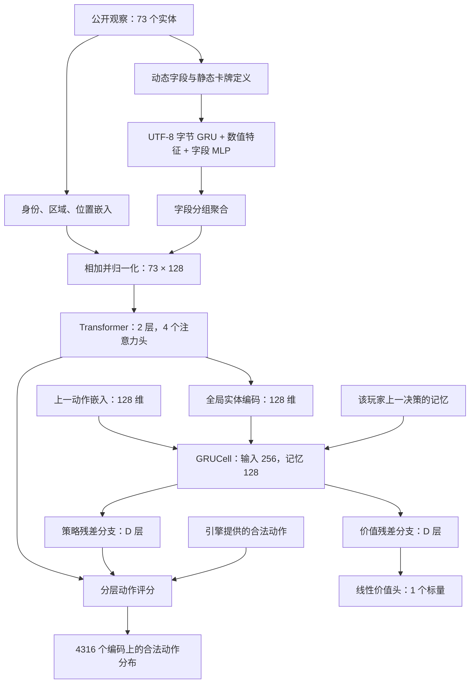

# 模型网络结构

本页对应 `entity-gru-resnet` 架构，按 2026-09-15 的仓库实现和训练服务器 manifest 核对。当前 64、256、1024 层模型使用同一套输入、宽度和动作协议，差别是策略与价值分支的残差层数。

## 一次决策怎样计算



每个玩家保存自己的记忆和上一动作。八席位之间不共享记忆；换模型、换对局或搜索分支时，也不能复用其他轨迹的 GRU 状态。

## 模型看见什么

观察版本为 4，实体格式为 3，动作版本为 2。`scouting-v4` 是线上推理的观察契约名称。这些编号与网络深度、训练包文件名中的 `v3` 含义不同。

| 实体区域 | 槽位数 | 内容 |
| --- | ---: | --- |
| global | 1 | 回合、金币、酒馆等级、升级费用、生命和护甲、技能状态、计数器、公开战况 |
| board | 7 | 自己的战场 |
| shop | 16 | 酒馆随从，包括特殊扩展栏位 |
| spellShop | 7 | 酒馆法术 |
| hand | 10 | 自己的手牌 |
| discovery | 4 | 当前发现候选 |
| lastEnemy | 7 | 上一场已公开的敌方阵容 |
| opponents | 7 | 对手公开资料 |
| powers | 2 | 当前装备的英雄技能 |
| powerOffers | 4 | 当前技能选择候选 |
| trinketOffers | 4 | 当前饰品选择候选 |
| trinkets | 4 | 已装备饰品 |
| 合计 | 73 | 未占用槽位通过掩码屏蔽 |

牌的字段包含身份、攻击、生命、金色状态、关键词、附加效果和计数。公开战况包含八席位最近两回合的阵容类型、对手座位、胜负和伤害。模型看不到对手当前招募阵容、手牌、真实剩余共享牌池或未来随机结果。

回合数 `turn`、当前金币 `gold`、升本费用 `upgrade` 明确进入全局实体。它们能影响抓牌和升本选择，但是否学会合理的经济节奏取决于训练数据和优化结果。

输入直接来自规则状态，不读取卡面截图。图片识别只属于单独的视频标注流程。旧 `mlp` 架构使用 3209 维平坦观察，当前三个深层模型使用实体编码。

## 字段编码与注意力

卡牌身份、区域和位置分别映射到 128 维嵌入。动态状态按字段展开，与静态卡牌定义一起编码，保留字段路径和嵌套关系。

字符串按有序 UTF-8 字节编码：257 项字节词表、12 维字节嵌入、24 维 GRU 输出。字段编码拼接键名 24 维、文本值 24 维、数值特征 4 维和类型嵌入 8 维，经过 `60 → 128 → 128` 的 MLP。数值特征包含带符号的对数缩放、tanh 缩放和类型标志。

同组字段取均值，再拼接 24 维路径编码及字段数量特征，经 `153 → 128` 映射。分组结果累加到对应实体，加上身份、区域、位置和静态定义编码，经过 LayerNorm 后进入 Transformer。

Transformer 为两层，每层宽度 128、四个注意力头、前馈宽度 256、GELU、前置 LayerNorm，dropout 为 0。它让全局状态、手牌、战场和商店之间交换信息。

全局实体输出与上一动作的 128 维嵌入拼接，作为 `GRUCell(256, 128)` 的输入。上一动作词表额外保留一个开局标记。

字符串推理缓存仅在冻结推理期间使用，开始训练时清空。数值特征缓存只复用确定的数学变换，不缓存依赖模型权重的训练输出。超长字符串或超出编码容量会报错，不静默丢弃字段。

## 64、256、1024 层怎样计数

记忆向量分别进入策略塔和价值塔。两塔参数独立，结构相同。每个残差块包含四组：

```text
Linear(128, 128) → LayerNorm(128) → SiLU
```

若分支深度为 D，则有 `D / 4` 个残差块。每块输出为：

```text
x + branch(x) / sqrt(D / 4)
```

分支末尾再做一次 LayerNorm。深度只计残差分支内的 Linear 层，不计归一化、激活、编码器和最终输出头。

| 名称 | 每个分支的残差块数 | 每个分支的 Linear 数 | 两个分支的 Linear 总数 | 全模型参数量 |
| --- | ---: | ---: | ---: | ---: |
| 64 层 | 16 | 64 | 128 | 3,421,950 |
| 256 层 | 64 | 256 | 512 | 9,860,862 |
| 1024 层 | 256 | 1024 | 2048 | 35,616,510 |

参数量来自当前三份训练 manifest，使用宽度 128 和当前固定词表。修改卡牌身份表、动作空间或宽度后需要重新统计。三种深度分别训练和保存权重，交换对手不会合并参数。

CLI 新建任务默认仍是较浅的 `entity-gru`。复现上表必须显式指定 `--architecture entity-gru-resnet` 及两条分支的深度。续训恢复检查点结构，不能靠改 `--policy-depth` 把旧检查点变成更深的网络。

## 策略与价值输出

策略头按“动作类型 → 来源 → 目标 → 放置位置”分层计算条件概率。来源和目标评分会查询 Transformer 编码后的实体。前缀归一化只考虑仍可形成合法动作的组合，最后形成 4316 个固定动作编码上的分布。

动作覆盖购买、出售、刷新、冻结、升本、出牌、站位、发现、技能和饰品。引擎提供合法动作掩码，执行时再次校验。动作容量是编码上限，某一步实际可选动作通常远少于 4316。

价值分支经 `Linear(128, 1)` 输出当前玩家的预期训练回报。它不是攻击力总和，也不是经过校准的吃鸡概率。启用第一名额外奖励后，训练回报上限可达到 +2。

## 训练、模仿与搜索使用同一网络

PPO 用当前策略采样的完整对局更新网络。序列训练保留玩家自己的决策顺序，并使用前置片段恢复记忆。损失和奖励详见 [训练流程](rl-training.md)。

模仿学习提高真人记录动作的概率，不把示范当作最优解，也不直接训练价值目标。共享编码器仍可能因模仿更新而改变价值估计，所以需要独立评估。

招募回合搜索冻结权重，以策略作为候选操作的先验，以价值头估计模拟末端。每条搜索分支保存独立记忆，每次只执行选出的第一个动作，再根据真实结果重新规划。当前训练不使用搜索访问分布作为学习目标，详见 [搜索说明](rl-recruit-search.md)。

## 对照源码

| 文件 | 核对内容 |
| --- | --- |
| `rl/entities.ts`、`rl/scouting.ts` | 实体槽位、公开字段及战况范围 |
| `rl/actions.ts` | 固定动作编码与合法动作 |
| `rl/python/tavern_rl/features.py` | 字段展开、分组和数值变换 |
| `rl/python/tavern_rl/entity_model.py` | 字节编码、Transformer、GRU、分层策略 |
| `rl/python/tavern_rl/deep_model.py` | 残差块、深度定义、策略与价值分支 |
| `rl/python/tavern_rl/recurrent.py` | 序列 PPO、预热与梯度更新 |
| `rl/python/tavern_rl/recruit_search.py` | 搜索树和价值回传 |

这些路径相对源码仓库根目录。独立训练包包含 Python 源码和已编译模拟器，TypeScript 源码需在仓库中查看。
